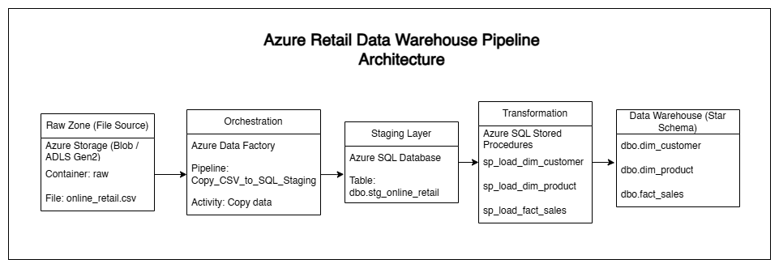
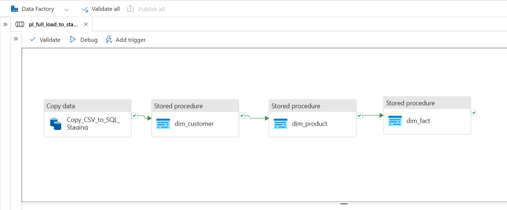
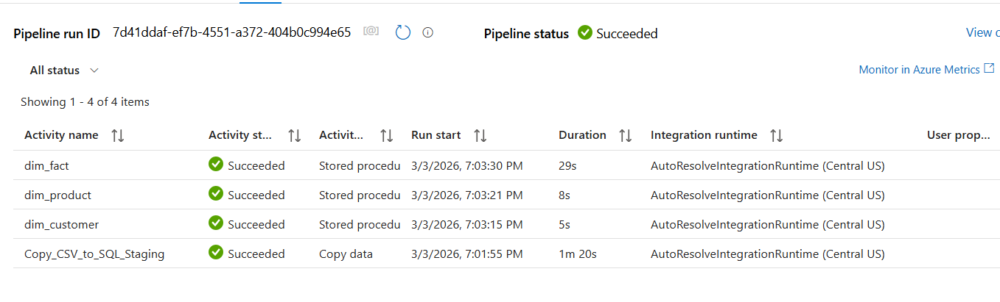
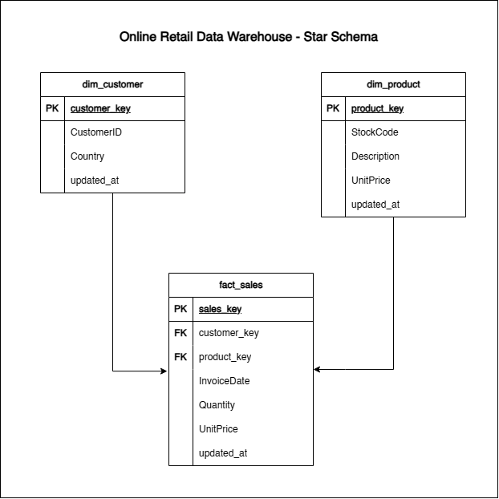

# Retail Data Warehouse Pipeline on Azure (ADF + Azure SQL)

## Overview

This project demonstrates an **end-to-end Azure Data Engineering pipeline** that ingests raw retail transaction data, loads it into a staging table, and builds a **dimensional data warehouse** using **Azure SQL** and **Azure Data Factory**.

The pipeline automates the flow of data from raw files into a structured **star schema** consisting of dimension and fact tables.

## Dataset

This project uses the **Online Retail dataset** available on Kaggle.

Source:  
https://www.kaggle.com/datasets/lakshmi25npathi/online-retail-dataset

The dataset contains transactional retail data including invoice number, product information, quantity, price, and customer details.

The raw CSV file is uploaded to **Azure Blob Storage** and ingested into the data warehouse pipeline.
---

## Architecture
### Pipeline Flow
        Azure Storage (Raw CSV)
                ↓
        Azure Data Factory - Copy Activity
                ↓
        Azure SQL - Staging Table (stg_online_retail)
                ↓
        Stored Procedures (Transformation)
                ↓
        Data Warehouse (Star Schema)
        ├── dim_customer
        ├── dim_product
        └── fact_sales



Azure Data Factory orchestrates the full pipeline execution.

---
## ADF Pipeline



---
## Pipeline Execution

The pipeline was executed successfully in Azure Data Factory.  
All activities completed without errors.



---
## Technologies Used

| Component | Technology |
|---|---|
| Cloud Platform | Microsoft Azure |
| Orchestration | Azure Data Factory |
| Data Warehouse | Azure SQL Database |
| Data Storage | CSV Dataset |
| Data Modeling | Star Schema |
| Version Control | Git + GitHub |
| Deployment | ARM Templates |

---

## Data Warehouse Design

The warehouse follows a **Star Schema** design.

The model consists of **dimension tables** and a **fact table** used for analytical queries.

---
## Star Schema


---
## Staging Table
### stg_online_retail

This table stores **raw data loaded from the CSV file** before transformation.

| Column | Description |
|---|---|
| InvoiceNo | Invoice number |
| StockCode | Product identifier |
| Description | Product description |
| Quantity | Quantity sold |
| InvoiceDate | Transaction date |
| UnitPrice | Price per unit |
| CustomerID | Customer identifier |
| Country | Customer country |
| updated_at | Load timestamp |

---

## Dimension Tables
### dim_customer

| Column | Description |
|---|---|
| customer_key | Surrogate key |
| CustomerID | Business key |
| Country | Customer country |
| updated_at | Load timestamp |

---

### dim_product

| Column | Description |
|---|---|
| product_key | Surrogate key |
| StockCode | Product business key |
| Description | Product description |
| UnitPrice | Product price |
| updated_at | Load timestamp |

---

## Fact Table
### fact_sales

| Column | Description |
|---|---|
| sales_key | Surrogate key |
| customer_key | Foreign key to dim_customer |
| product_key | Foreign key to dim_product |
| InvoiceDate | Transaction date |
| Quantity | Quantity sold |
| UnitPrice | Price per unit |
| updated_at | Load timestamp |

---

## Pipeline Execution Steps

1. Raw **CSV dataset** is uploaded.
2. **Azure Data Factory Copy Activity** loads the data into `stg_online_retail`.
3. Stored procedures transform the staging data into **dimension tables**.
4. The **fact table** is populated using keys from the dimension tables.
5. The pipeline completes the **end-to-end data warehouse load process**.

---
## Load Strategy

The current pipeline uses a **full refresh loading strategy**.

During each pipeline execution, the stored procedures truncate the dimension and fact tables and rebuild them from the staging table.

This approach was used to:

- simplify the initial warehouse build
- validate end-to-end pipeline execution
- avoid duplicate records during development

In production systems, this pattern is often replaced with **incremental loading strategies** using techniques such as watermark columns (`updated_at`) or `MERGE` operations to process only new or updated records.

---
## Repository Structure
```
sql/            SQL scripts for tables and stored procedures
arm_template/   ARM deployment templates
screenshots/    Pipeline execution screenshots
```
---

## Result
The pipeline successfully loads retail transaction data into a **structured star schema data warehouse** and automates the **data ingestion and transformation process** using Azure Data Factory.

---

## Author

**Bishal Manandhar**